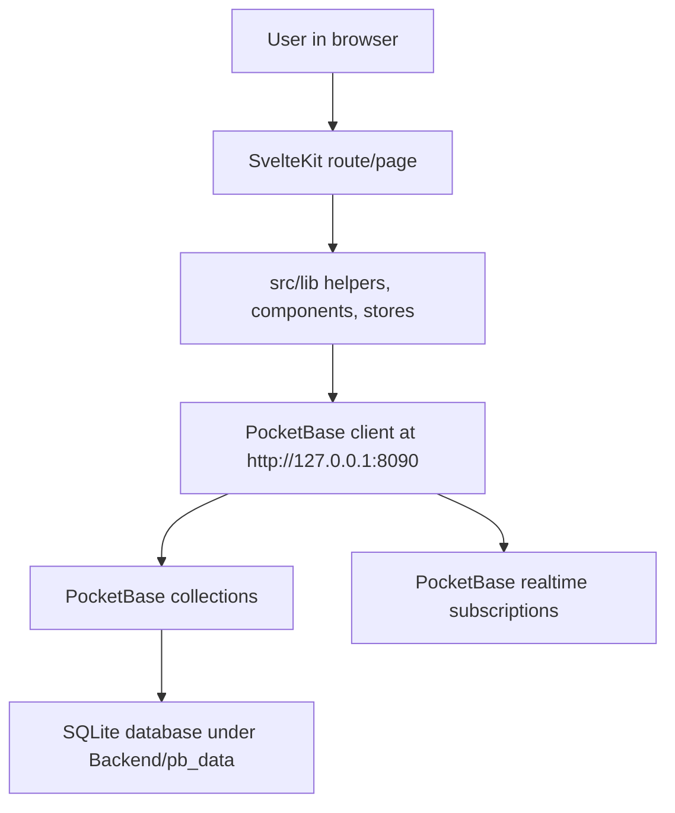

# System Overview

## Big Picture

This project is a full-stack app, but the stack is split differently than a typical React + API server setup:

- `frontend/` is the product UI built with SvelteKit.
- PocketBase is the backend platform.
- The frontend talks to PocketBase directly using the PocketBase JavaScript SDK.
- Authentication, file uploads, record CRUD, filtering, and realtime subscriptions are all handled through PocketBase.

That means the backend layer is mostly:

- PocketBase collections
- PocketBase auth
- PocketBase migration files
- PocketBase hooks
- PocketBase access rules

There is no custom controller/service/router layer in Node.

## Runtime Shape

## Main Architectural Decisions

## 1. Client-heavy frontend

Most data fetching happens inside Svelte components with `onMount()`.

Common pattern:

- Page mounts
- `requireAuth()` runs if page is protected
- Current user is pulled from `pb.authStore`
- Page queries one or more PocketBase collections
- UI renders based on collection results

This makes feature work fast, but it also means:

- Business logic is spread across pages/components instead of centralized services
- Many permissions depend on PocketBase rules instead of server middleware
- PocketBase schema changes can break the frontend directly

## 2. PocketBase is both database and API

PocketBase handles:

- User auth
- Email verification
- Password reset
- File storage for avatars, posts, menu images, recipes, etc.
- CRUD APIs for all collections
- Realtime subscriptions for messages, notifications, and orders

## 3. Auth state lives in the PocketBase SDK store

The single client is defined in `frontend/src/lib/pocketbase.js`:

- Base URL: `http://127.0.0.1:8090`
- Every page imports the same client instance

Auth checks mostly rely on:

- `pb.authStore.isValid`
- `pb.authStore.model`
- `pb.authStore.record`

## 4. SvelteKit is mostly used as a client app

Only a small number of routes explicitly set `ssr = false`, but in practice most feature data loading is done client-side.

Examples:

- `frontend/src/routes/home/+page.js`
- `frontend/src/routes/business/analytics/+page.js`
- `frontend/src/routes/demo/+page.js`

## Request And Data Flow

## Example: viewing a profile

1. User visits `/profile` or `/profile/[username]`
2. Page checks auth with `requireAuth()`
3. Page loads the user record from `users`
4. Page loads related data from `follows`, `posts`, `likes`, `comments`, `recipes`, `menuItems`, and `favorites`
5. UI renders one combined profile experience for social + commerce features

## Example: placing an order

1. User adds `menuItems` into the cart store
2. Checkout page collects address, notes, schedule, and payment method
3. Checkout creates an `orders` record in PocketBase
4. Business dashboard subscribes to `orders` realtime updates
5. Seller updates order status
6. Notifications are created for the buyer

## Important Shared Frontend Pieces

## Core lib files

- `frontend/src/lib/pocketbase.js`: PocketBase client singleton
- `frontend/src/lib/auth.js`: auth guard helper and auth state helpers
- `frontend/src/lib/Notifications.js`: helper wrapper for creating notifications
- `frontend/src/lib/recommendations.js`: recommendation engine logic
- `frontend/src/lib/Menuattributes.js`: menu classification constants and scoring metadata

## Shared stores

- `frontend/src/lib/stores/cart.ts`: cart lines, seller grouping, checkout state
- `frontend/src/lib/stores/ui.ts`: UI state like cart drawer visibility
- `frontend/src/lib/stores/stories.js`: story/highlight state

## Shared components that carry feature logic

- `Header.svelte`: navigation, notifications, cart entry
- `PostModal.svelte`: comments, likes, post deletion
- `MenuItemForm.svelte`: menu CRUD form and modifier handling
- `RecommendedFeed.svelte`: recommendation-driven feed rendering
- `NotificationsPanel.svelte`: notifications UI + realtime

## Where To Look For Different Kinds Of Changes

- New page or route behavior: `frontend/src/routes/`
- Shared UI or feature modal: `frontend/src/lib/components/`
- Auth or session handling: `frontend/src/lib/auth.js` and auth routes
- Cart and checkout behavior: `frontend/src/lib/stores/cart.ts` and checkout routes
- Recommendation logic: `frontend/src/lib/recommendations.js`
- Schema changes: `Backend/pb_migrations/`
- Backend automation or custom backend-side logic: `Backend/pb_hooks/`

## What Is Not Here

The repo does not currently contain:

- A custom REST API server
- A server-side business logic layer in Node
- Backend unit-tested domain services
- A root-level documented dev orchestration script for frontend + PocketBase together

That is important context for anyone onboarding: most product logic is embedded directly in pages/components and enforced through PocketBase rules plus frontend code.
