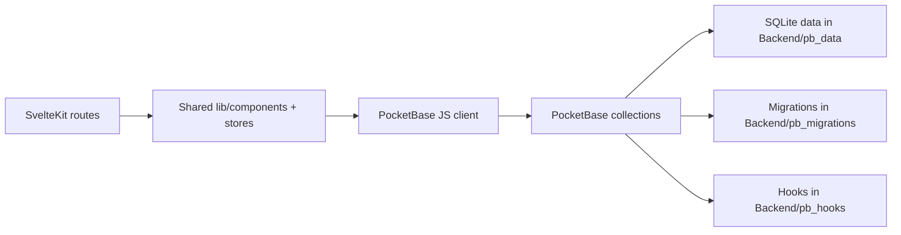

# Codebase Map

This folder is an onboarding map for the `FoodEcommerceApp` repository.

If you are new to the project, read the files in this order:

1. [01-system-overview.md](./01-system-overview.md)
2. [02-frontend-routes.md](./02-frontend-routes.md)
3. [03-pocketbase-backend.md](./03-pocketbase-backend.md)
4. [04-auth-and-user-lifecycle.md](./04-auth-and-user-lifecycle.md)
5. [05-feature-flows.md](./05-feature-flows.md)
6. [06-new-contributor-guide.md](./06-new-contributor-guide.md)

## What this app is

FIESTRA is a SvelteKit frontend that talks directly to a PocketBase backend.

- The frontend lives in `frontend/`.
- The PocketBase binary, data, migrations, and hooks live in `Backend/`.
- There is no separate custom Node/Express backend in this repository.
- Most "backend routes" are PocketBase collection APIs such as `/api/collections/users/records`, `/api/collections/posts/records`, etc.

## Top-Level Repo Map

```text
FoodEcommerceApp/
├── Backend/
│   ├── pocketbase                 # PocketBase executable
│   ├── pb_data/                   # Local database and generated PocketBase typings
│   ├── pb_migrations/             # Schema history
│   └── pb_hooks/                  # PocketBase hooks
├── frontend/
│   ├── src/routes/                # SvelteKit pages
│   ├── src/lib/components/        # Reusable UI + feature components
│   ├── src/lib/stores/            # Cart/UI state
│   └── src/lib/                   # PocketBase client, auth helper, recommendations, etc.
├── pb_schema.json                 # Schema snapshot
├── pb_schema-2.json               # Another schema snapshot
└── codebase-map/                  # This onboarding documentation
```

## Architecture At A Glance



## Source-Of-Truth Notes

When docs and code disagree, trust these sources in this order:

1. Current frontend usage in `frontend/src/`
2. Latest PocketBase migrations in `Backend/pb_migrations/`
3. Live PocketBase data/schema in `Backend/pb_data/`
4. Schema snapshots like `pb_schema.json`

The snapshots appear slightly older than the current frontend in a few places, so they are useful but not always complete.
